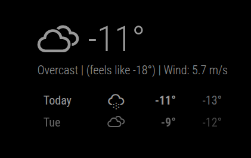

# MMM-YandexWeather

A [MagicMirror²](https://github.com/MagicMirrorOrg/MagicMirror) module for displaying weather information from [Yandex Weather API v3](https://yandex.ru/dev/weather/).

## Features

- 🌡️ **Current weather** with temperature, humidity, wind, and weather conditions
- 📅 **Daily forecast** for up to 10 days
- ⏰ **Hourly forecast** for detailed predictions
- 🎨 **Customizable display** with multiple configuration options
- 🌍 **Multi-language support** (Russian and English)
- 🎨 **Optional colored weather icons**
- 📊 **"Feels like" temperature**

## Screenshot



## Prerequisites

- MagicMirror² version 2.1.0 or higher
- **Yandex Weather API key** (required)

### Getting a Yandex Weather API Key

1. Go to [Yandex Weather API Console](https://yandex.ru/dev/weather/)
2. Sign in with your Yandex account (or create one)
3. Subscribe to the API service
4. Choose a tariff plan (there's a free "Test" plan available)
5. Generate an API key
6. Copy the key for use in the module configuration

## Installation

### Install

In your terminal, navigate to your MagicMirror's modules directory and clone this repository:

```bash
cd ~/MagicMirror/modules
git clone https://github.com/isemenov/MMM-YandexWeather
cd MMM-YandexWeather
npm install
```

### Update

Navigate to the module directory and pull the latest changes:

```bash
cd ~/MagicMirror/modules/MMM-YandexWeather
git pull
npm install
```

## Configuration

To use this module, add the following configuration block to the `modules` array in the `config/config.js` file:

### Minimal Configuration

```javascript
{
    module: 'MMM-YandexWeather',
    position: 'top_right',
    config: {
        apiKey: 'YOUR_YANDEX_WEATHER_API_KEY',
        lat: 55.75396,  // Your location latitude
        lon: 37.620393  // Your location longitude
    }
}
```

### Full Configuration

```javascript
{
    module: 'MMM-YandexWeather',
    position: 'top_right',
    config: {
        // Required
        apiKey: 'YOUR_YANDEX_WEATHER_API_KEY',

        // Location
        lat: 55.75396,              // Latitude (Moscow by default)
        lon: 37.620393,             // Longitude (Moscow by default)

        // Update and Display
        updateInterval: 600000,     // Update interval in ms (10 minutes)
        animationSpeed: 1000,       // Animation speed in ms
        lang: 'ru',                 // Language: 'ru' or 'en'

        // Forecast Options
        showForecast: true,         // Show daily forecast
        maxNumberOfDays: 7,         // Max days to show (1-10)
        showHourlyForecast: false,  // Show hourly forecast
        maxHourlyForecastEntries: 12, // Max hours to show

        // Display Options
        showFeelsLike: true,        // Show "feels like" temperature
        showHumidity: true,         // Show humidity
        showWind: true,             // Show wind information
        showDescription: true,      // Show weather description
        roundTemp: true,            // Round temperature values
        colored: false,             // Use colored weather icons
        fade: true,                 // Fade forecast items
        fadePoint: 0.25,            // Where to start fading (0-1)
        tableClass: 'small'         // Table size: xsmall, small, medium, large, xlarge
    }
}
```

## Configuration Options

| Option | Type | Default | Description |
|--------|------|---------|-------------|
| `apiKey` | `string` | **Required** | Your Yandex Weather API key |
| `lat` | `number` | `55.75396` | Latitude of your location |
| `lon` | `number` | `37.620393` | Longitude of your location |
| `updateInterval` | `number` | `600000` | Update interval in milliseconds (default: 10 minutes) |
| `animationSpeed` | `number` | `1000` | Animation speed for DOM updates in milliseconds |
| `lang` | `string` | `'ru'` | Language for labels: `'ru'` or `'en'` |
| `showForecast` | `boolean` | `true` | Show daily forecast section |
| `maxNumberOfDays` | `number` | `7` | Maximum number of forecast days to display (1-10) |
| `showHourlyForecast` | `boolean` | `false` | Show hourly forecast section |
| `maxHourlyForecastEntries` | `number` | `12` | Maximum number of hourly entries to display |
| `showFeelsLike` | `boolean` | `true` | Show "feels like" temperature |
| `showHumidity` | `boolean` | `true` | Show humidity information |
| `showWind` | `boolean` | `true` | Show wind information |
| `showDescription` | `boolean` | `true` | Show weather condition description |
| `roundTemp` | `boolean` | `true` | Round temperature values to integers |
| `colored` | `boolean` | `false` | Use colored weather icons |
| `fade` | `boolean` | `true` | Fade forecast items |
| `fadePoint` | `number` | `0.25` | Point where fading begins (0-1) |
| `tableClass` | `string` | `'small'` | Table size class: `'xsmall'`, `'small'`, `'medium'`, `'large'`, `'xlarge'` |

## Finding Your Location Coordinates

To find the latitude and longitude for your location:

1. Go to [Google Maps](https://maps.google.com)
2. Right-click on your desired location
3. Click on the coordinates to copy them
4. Use the first number as `lat` and the second as `lon`

Or use online tools like:
- [LatLong.net](https://www.latlong.net/)
- [GPS Coordinates](https://gps-coordinates.org/)

## API Rate Limits

Yandex Weather API has usage limits depending on your tariff plan:
- **Test plan**: Limited number of requests per day (free)
- **Paid plans**: Higher limits based on subscription

Recommended `updateInterval`:
- For test plan: 600000 ms (10 minutes) or higher
- For paid plans: Can be lower based on your needs

## Troubleshooting

### Module shows "API key is missing"
- Make sure you've set the `apiKey` in your configuration
- Verify the API key is correct and active

### Module shows "Error" or no data
- Check your API key is valid
- Verify your internet connection
- Check the browser console (F12) for error messages
- Ensure you haven't exceeded your API rate limit
- Verify the `lat` and `lon` coordinates are correct

### Weather data is not updating
- Check your `updateInterval` setting
- Verify you haven't exceeded API rate limits
- Check the MagicMirror logs for errors

### Icons not displaying correctly
- Ensure the Weather Icons font is loaded by MagicMirror
- Check that `weather-icons.css` is available in your MagicMirror installation

## Branding Requirements

According to Yandex Weather API terms of service:
- If weather data will be publicly accessible, you must comply with Yandex Weather branding guidelines
- This may include displaying a "Powered by Yandex.Weather" notice or logo
- Check the [official documentation](https://yandex.ru/dev/weather/) for current requirements

## Developer Commands

- `npm install` - Install dependencies
- `npm run lint` - Run linting checks
- `npm run lint:fix` - Fix linting issues
- `npm test` - Run tests

## Credits

- Weather data: [Yandex Weather API](https://yandex.ru/dev/weather/)
- Weather icons: [Weather Icons](https://erikflowers.github.io/weather-icons/)
- MagicMirror²: [MagicMirror Project](https://magicmirror.builders/)

## License

This project is licensed under the MIT License - see the [LICENSE.md](LICENSE.md) file for details.

## Changelog

See [CHANGELOG.md](CHANGELOG.md) for version history and changes.

## Contributing

Contributions are welcome! Please feel free to submit a Pull Request.

1. Fork the repository
2. Create your feature branch (`git checkout -b feature/AmazingFeature`)
3. Commit your changes (`git commit -m 'Add some AmazingFeature'`)
4. Push to the branch (`git push origin feature/AmazingFeature`)
5. Open a Pull Request

## Support

If you encounter any issues or have questions:
- Check the [Troubleshooting](#troubleshooting) section
- Open an issue on [GitHub](https://github.com/isemenov/MMM-YandexWeather/issues)
- Check the [MagicMirror Forum](https://forum.magicmirror.builders/)

## Acknowledgments

- Thanks to the MagicMirror² community
- Thanks to Yandex for providing the Weather API

## Development

### Quality Checks

Run comprehensive quality checks before committing:

```bash
./check.sh           # Check only
./check.sh --fix     # Check and auto-fix issues
./check.sh --help    # Show usage
```

The check script performs:
- ✅ **Linting** - ESLint code quality checks
- ✅ **Security Audit** - npm audit for vulnerabilities  
- ✅ **Dependencies** - Check for outdated packages
- ✅ **JSON Validation** - Verify all JSON files
- ✅ **File Checks** - Ensure required files exist
- ✅ **Code Issues** - Detect TODO/FIXME, hardcoded keys, etc.
- ✅ **Git Status** - Show uncommitted changes

### Available Scripts

```bash
npm run lint          # Run ESLint
npm run lint:fix      # Auto-fix ESLint issues
npm run check         # Run all quality checks
npm run audit         # Security audit only
```

### Rate Limiting

The module enforces Yandex Weather API free tier limits:
- **Maximum:** 50 requests per day
- **Tracking:** Stored in `.api_rate_limit.json` (auto-created)
- **Reset:** Automatically at midnight
- **Current usage:** Logged with each request

Configure update interval to stay within limits:
```javascript
updateInterval: 60 * 60 * 1000  // 60 minutes = ~48 requests/day
```
